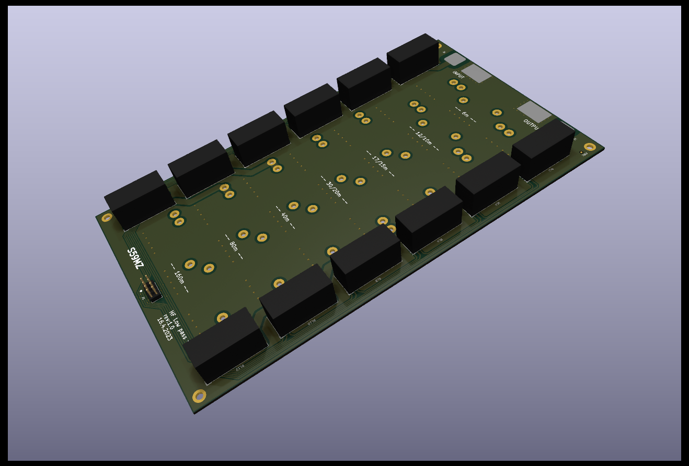
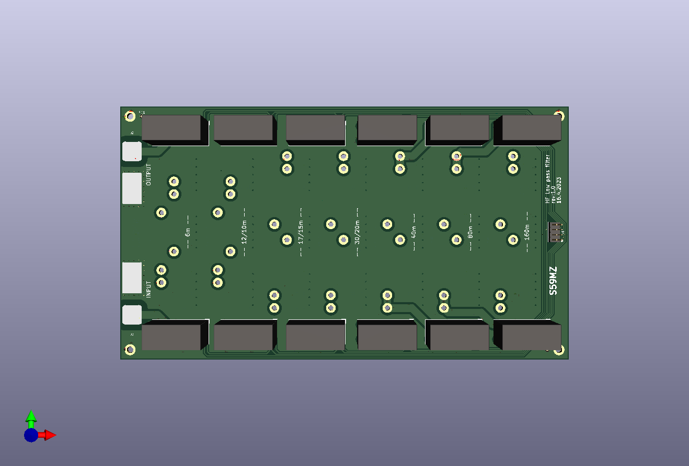
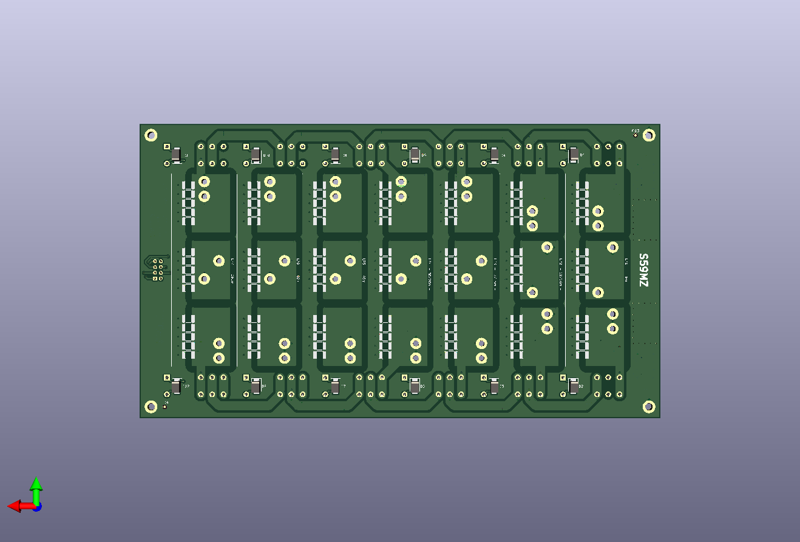

# kicad-lp_filter
Low pass filter for HF Power Amplifier

Schematic:
[low_pass.pdf](low_pass.pdf)

BOM:
[low_pass.csv](low_pass.csv)

Gerbers:
[gerbers.zip](https://github.com/s59mz/kicad-lp_filter/raw/main/gerbers.zip)
